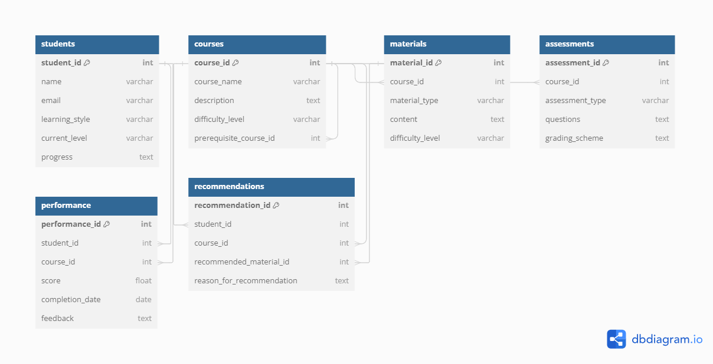
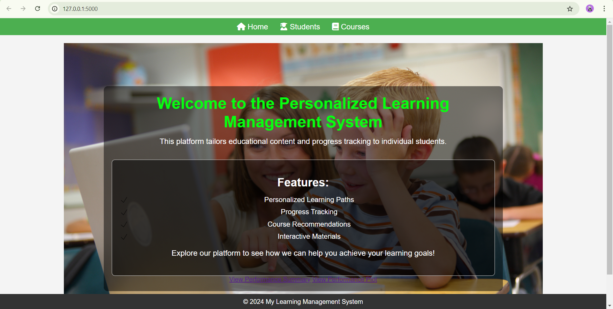

# Learning-Management-System

## Project Overview:
The Personalized Learning Management System is designed to manage student profiles, courses, assessments, and performance data. It aims to enhance the learning experience by providing insightful metrics and tracking progress through a user-friendly interface.

## Features Implemented:
#### Course Management:
* Add and Manage Courses: Allows for the creation and management of courses within the system. 
* Course Details View: Provides detailed information about each course, including descriptions and materials.

#### Student Profiles:
* Create and Manage Profiles: Students can create and manage their profiles, including personal information and enrollment details. 
* Progress Tracking: Keeps track of each student’s progress in various courses.

#### Assessment Management:
* Add and Evaluate Assessments: Allows instructors to add assessments and evaluate student performance. 
* Performance Metrics: Tracks and displays metrics related to assessment performance.

#### Database Management:

* ER Diagram: The database schema is designed to support efficient querying and management of student, course, and assessment data. 
* SQL Queries: Includes complex queries for joining tables, aggregating data, and retrieving performance metrics.

## ER Diagram

## Home Page

## Project Installation and Usage:

Clone the Repository:
git clone https://github.com/bhagyashridomb/Learning-Management-System.git

Navigate to the Project Directory:
###### cd Personalized-Learning-Management-System

Set Up the Virtual Environment:
###### python -m venv venv
###### source venv/bin/activate  # On Windows: venv\Scripts\activate

Install Dependencies:
###### pip install -r requirements.txt

Run the Application:
###### python run.py